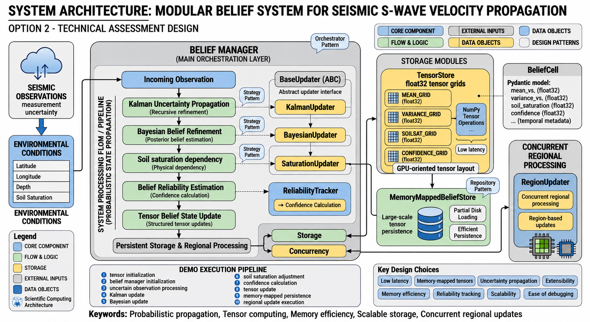

# seismo-ai-agent

A modular AI-driven seismic analysis platform for:

- near-real-time seismic ingestion,
- hybrid Retrieval-Augmented Generation (RAG),
- probabilistic BELIEF-state propagation,
- uncertainty-aware scientific computing.

The project was developed as part of an advanced AI software engineering technical assessment focused on scalable AI systems, scientific-computing architectures, probabilistic reasoning, and geophysical data processing.

---

# System Overview

The platform is organized into three independent subsystems:

- **Perception Layer** for near-real-time seismic ingestion,
  synchronization, validation, and scientific deduplication.

- **Hybrid RAG Layer** for semantic retrieval,
  metadata-aware filtering, and retrieval completeness evaluation.

- **BELIEF Layer** for probabilistic state propagation,
  uncertainty-aware scientific computing, and scalable tensor-based storage.

The architecture emphasizes modularity, extensibility,
low-latency execution, and maintainable scientific AI workflows.

---

# Repository

```text
seismo-ai-agent/
│
├── api/
├── belief/
├── perception/
├── rag/
├── shared/
├── tests/
├── docs/
├── diagram/
│
├── main.py
├── requirements.txt
├── Dockerfile
└── README.md
```

---

# Project Modules

| Module | Description |
|---|---|
| Perception System | Near-real-time seismic ingestion and synchronization |
| Hybrid RAG Pipeline | Semantic seismic information retrieval |
| BELIEF-State System | Probabilistic uncertainty propagation |

---

# Documentation

## Option 1 — Task 1

### Perception System

- [Perception System Report](docs/option1_perception_system_report.md)

### Engineering Notes

- [Stable Event Identifier Bug Report](docs/engineering_notes/deduplication_bug_report.md)
- [FastAPI SQLite Threading Issue](docs/engineering_notes/fastapi_sqlite_threading_issue.md)
- [Pytest Package Resolution Bug Report](docs/engineering_notes/pytest_import_issue.md)

---

## Option 1 — Task 2

### Hybrid RAG Pipeline

- [Hybrid RAG Pipeline Report](docs/option1_rag_pipeline_report.md)

### Engineering Notes

- [Hierarchical Filtering Bugfix Report](docs/engineering_notes/hierarchical_filtering_bugfix_report.md)
- [Hierarchical Metadata Filtering Report](docs/engineering_notes/hierarchical_metadata_filtering_report.md)
- [Hybrid Retrieval Evaluation Report](docs/engineering_notes/hybrid_retrieval_evaluation_report.md)
- [Query Expansion and Retrieval Planning Report](docs/engineering_notes/query_expansion_and_retrieval_planning_report.md)
- [Retrieval Duplication Debug Report](docs/engineering_notes/retrieval_duplication_debug_report.md)

---

## Option 2

### BELIEF-State Architecture

- [BELIEF-State Architecture Report](docs/option2_belief_state_report.md)

### Architecture Diagram

- [System Architecture Diagram](diagram/Option2_diagram.png)


---

# Scientific References

The following papers were used during system design and architectural development:

- [Near-Real-Time Integration of Multi-Source Seismic Data](docs/references/near_real_time_seismic_data_integration.pdf)
- [A Survey on Epistemic Uncertainty in Supervised Learning](docs/references/epistemic_uncertainty_survey_2021.pdf)
- [Ensemble Kalman Filter with Epistemic Uncertainty](docs/references/ensemble_kalman_epistemic_uncertainty_2024.pdf)
- [Uncertainty Propagation in Seismic Inversion](docs/references/uncertainty_propagation_seismic_inversion_2024.pdf)
- [Physics-Informed Deep Learning for Seismic Uncertainty](docs/references/pinn_uncertainty_hypocenter_determination_2025.pdf)
---

# Installation

## Clone Repository

```bash
git clone git@github.com:afroozmohandesian/seismo-ai-agent.git
cd seismo-ai-agent
```

---

## Create Virtual Environment

```bash
python -m venv .venv
source .venv/bin/activate
```

---

## Install Dependencies

```bash
pip install -r requirements.txt
```

---

# Running the Application

## Start API

```bash
python main.py
```

---

## Run Tests

```bash
pytest
```

---

# Docker

## Build Image

```bash
docker build -t seismo-ai-agent .
```

## Run Container

```bash
docker run -p 8000:8000 seismo-ai-agent
```

---

# Technologies

- Python
- FastAPI
- SQLite
- NumPy
- FAISS
- Sentence Transformers
- BM25
- Pydantic
- Pytest
- Docker

---

# Branches

| Branch | Purpose |
|---|---|
| `feature/perception-listener` | Seismic ingestion system |
| `feature/rag-system` | Hybrid RAG retrieval |
| `feature/belief-state-system` | BELIEF-state propagation |
| `main` | Integrated stable branch |

---

# Author

Afrooz Mohandesian